# Niceone Obsidian

  

<h1 align="center">AI Systems Architect · Automation Engineer · Open-Source Builder</h1>

  Building governed AI systems that turn objectives into controlled, measurable, repeatable outcomes.

  
  

  
  

---

  

  

## 🧠 What I'm Building

### OIS — Obsidian Intelligence System

> A capability-driven AI intelligence and execution system designed to turn objectives into controlled, measurable, repeatable outcomes.

**Cognition → Policy → Capabilities → Agents → Tools → Models → Execution → Validation → Recovery → Evidence → Measurement → Learning → Controlled Evolution**

**Operating loop:** Think → Verify → Authorize → Act → Validate → Measure → Learn → Evolve

---

## 📊 GitHub Intelligence

  
  

  

  

---

## 🏗️ Engineering Philosophy

I build AI systems around explicit execution boundaries rather than treating model output as authority.

- **Reasoning is not authorization**
- **Architecture is not implementation**
- **Execution is not success**
- **Evidence precedes promotion**
- **Failures must be recoverable**
- **Production change must be measurable and reversible**
- **Learning must be grounded in observed outcomes**

---

## 🔬 Current Focus

| Area | Focus |
| --- | --- |
| 🧠 OIS Kernel | Stateful execution, contracts, planning, orchestration |
| 🛡️ Control Plane | Policy, authorization, routing, lifecycle governance |
| 🧩 Capability Fabric | Capability, agent, tool, and workflow registries |
| ⚙️ Runtime | Durable execution, checkpoints, idempotency, recovery |
| ✅ Validation | Outcome verification and append-only execution evidence |
| 📈 Observability | Telemetry, traces, metrics, operational evidence |
| 🗃️ Knowledge | Context, memory, retrieval, semantic state |
| ♻️ Evolution | Measurement, evaluation, promotion, rollback |
| 📣 Social Intelligence | Content intelligence, growth systems, experimentation |

---

## 🧰 Technology Stack

### 💻 Languages

  
  
  
  

  <b>Python</b>&nbsp;&nbsp;&nbsp;&nbsp;
  <b>JavaScript</b>&nbsp;&nbsp;&nbsp;&nbsp;
  <b>TypeScript</b>&nbsp;&nbsp;&nbsp;&nbsp;
  <b>Bash</b>

### ⚡ Runtime & Application

  

  <b>Node.js</b>&nbsp;&nbsp;&nbsp;&nbsp;
  <b>React</b>&nbsp;&nbsp;&nbsp;&nbsp;
  <b>GraphQL</b>&nbsp;&nbsp;&nbsp;&nbsp;
  <b>Selenium</b>

### 🗄️ Data & Backend

  

  <b>PostgreSQL</b>&nbsp;&nbsp;&nbsp;&nbsp;
  <b>Redis</b>&nbsp;&nbsp;&nbsp;&nbsp;
  <b>Supabase</b>

### ☁️ Infrastructure & DevOps

  
  
  
  

  <b>Docker</b>&nbsp;&nbsp;&nbsp;&nbsp;
  <b>GitHub</b>&nbsp;&nbsp;&nbsp;&nbsp;
  <b>AWS</b>&nbsp;&nbsp;&nbsp;&nbsp;
  <b>GitHub Actions</b>&nbsp;&nbsp;&nbsp;&nbsp;
  <b>Linux</b>

### 🛠️ Developer Environment

  

  <b>Git</b>&nbsp;&nbsp;&nbsp;&nbsp;
  <b>Neovim</b>&nbsp;&nbsp;&nbsp;&nbsp;
  <b>Figma</b>&nbsp;&nbsp;&nbsp;&nbsp;
  <b>VS Code</b>

### 🧠 AI, Knowledge & Workflow

  
  
  

  <b>OpenAI</b>&nbsp;&nbsp;&nbsp;&nbsp;
  <b>Obsidian</b>&nbsp;&nbsp;&nbsp;&nbsp;
  <b>Notion</b>&nbsp;&nbsp;&nbsp;&nbsp;
  <b>Termux</b>

---

## 🚀 Featured Work

### <a href="https://github.com/niceoneobsidian/niceone-obsidian">OIS — Obsidian Intelligence System</a>

**Governed, stateful, capability-driven AI execution and intelligence platform.**

Current engineering themes:

- Explicit execution state transitions
- Durable PostgreSQL-backed execution state
- Idempotency protection
- Append-only evidence and database safeguards
- Bounded retry and recovery decisions
- Migration validation and integration testing
- Conformance tests for recovery and governance
- Quality gates and operational verification

The OIS repository remains the source of truth for implementation status.

---

## 🔭 Research & Systems

- Agentic AI architectures
- Capability-driven systems
- Durable execution and recovery
- AI memory and retrieval
- Evaluation and verification
- Observability and measurement
- Social intelligence and growth systems
- Controlled AI system evolution
- Developer tooling and automation

---

## 🤝 Collaboration

Interested in:

- AI infrastructure
- Agent and execution systems
- Automation
- Developer tooling
- Reliable and observable AI
- Governance and authorization
- Open-source AI systems

---

## 🔗 Connect

  
  

---

## 🐍 Contribution Snake

  <picture>
    <source media="(prefers-color-scheme: dark)" srcset="https://raw.githubusercontent.com/niceoneobsidian/niceoneobsidian/output/github-contribution-grid-snake-dark.svg">
    <source media="(prefers-color-scheme: light)" srcset="https://raw.githubusercontent.com/niceoneobsidian/niceoneobsidian/output/github-contribution-grid-snake.svg">
    
  </picture>

  Generated automatically by GitHub Actions from the contribution graph.

  Think deeply · Verify everything · Authorize before acting · Execute precisely · Validate outcomes · Learn from evidence

